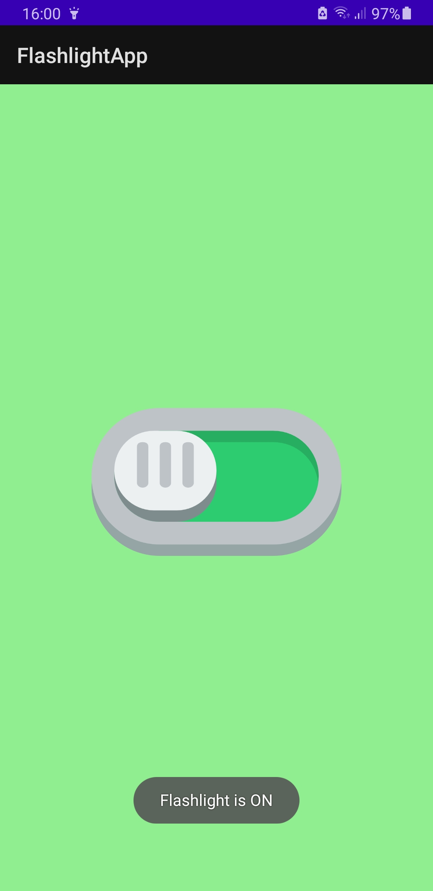

# FlashLightApp
# The App:

This is my first **Android** application. It's simple and it performs one task(turns the phone flashlight On or Off). 

It's purpose might not be extraordinary since most of the phones have this feature already built-in, 

but as a beginner I learned many things building it. 

# Preview:

# What have I learned?

- [x]  How to create a simple application layout
- [x]  What tools are available and how to use them in the **Design section**
- [x]  To write XML and design the interface both by writing XML or using the **Design**
- [x]  How to select app components by their ID and assign them to variables
- [x]  How to access the **vibration, camera flash & set a different background by accessing the XML**
- [x]  How to create a Toast
- [x]  How to build & export as **APK**

### FYI:

**The app is ready to use so feel free to install the .apk file on your Android smartphone.**

**You might need to go to your settings and "Enable Unknown Sources", and you may receive some GooglePlay warnings along the installation.**
